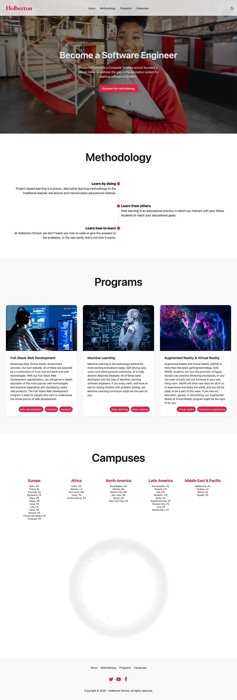
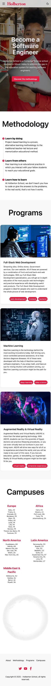

# REACT and Daisy

## Description

This project was developed as part of a live coding session at Holberton School Toulouse.

The goal was to demonstrate how to quickly set up a React project using Vite, TailwindCSS, Lucide React, and DaisyUI, in order to build a simple and clean landing page within a very short time.

The chosen theme for this demonstration was a small presentation page about Holberton School, allowing students to see how to design, structure, and style a responsive page directly in React JSX.

After the live session (≈ 1 hour), the project was refined for an additional two hours to finalize a presentable version.

This project serves as a reference for beginners looking to understand the foundations of a React front-end workflow and how to use utility-first frameworks efficiently.

Watch the live coding sessions here:

- Live coding session (FR) - *Coming soon*.

## Objectives

- Show how to initialize and configure a React project using Vite.
- Introduce Lucide React for using modern and lightweight icons.
- Demonstrate the use of Tailwind CSS and DaisyUI for rapid UI prototyping.
- Build a responsive landing page in just a few hours.
- Keep the code accessible, readable, and educational for newcomers.

## Tech Stack


## File Description

| **FILE**            | **DESCRIPTION**                                                 |
| :-----------------: | --------------------------------------------------------------- |
| `public`            | Public assets.                                                  |
| `src`               | React source code (components, utilities...).                   |
| `index.html`        | HTML entry point of the application.                            |
| `vite.config.js`    | Vite configuration for development and building.                |
| `package.json`      | Dependencies and scripts configuration.                         |
| `package-lock.json` | Automatically generated file locking exact dependency versions. |
| `eslint.config.js`  | Linter configuration to enforce code quality.                   |
| `.gitignore`        | Specifies files and folders to be ignored by Git.               |
| `README.md`         | The README file you are currently reading 😉.                   |

## Installation & Usage

### Installation

1. Clone this repository:
    - Open your preferred Terminal.
    - Navigate to the directory where you want to clone the repository.
    - Run the following command:

```
git clone https://github.com/fchavonet/live_coding-react_and_daisy.git
```

2. Open the cloned repository.

3. Install dependencies:

```
npm install
```

4. Start the development server:

```
npm run dev
```

### Usage

1. Once the local server is running, open your browser and navigate to the provided local URL (usually http://localhost:3000).

2. You can explore, modify, and experiment with the page structure or styles to make it your own.

You can also test the project online by clicking [here](https://fchavonet.github.io/live_coding-react_and_daisy/).

<table align="center">
    <tr>
        <th align="center" style="text-align: center;">Desktop view</th>
        <th align="center" style="text-align: center;">Mobile view</th>
    </tr>
    <tr valign="top">
        <td align="center">
            <picture>
                <source media="(prefers-color-scheme: light)" srcset="./public/images/screenshots/screenshot-desktop-react_and_daisy-light.webp">
                <source media="(prefers-color-scheme: dark)" srcset="./public/images/screenshots/screenshot-desktop-react_and_daisy-dark.webp">
                
            </picture>
        </td>
        <td align="center">
            <picture>
                <source media="(prefers-color-scheme: light)" srcset="./public/images/screenshots/screenshot-mobile-react_and_daisy-light.webp">
                <source media="(prefers-color-scheme: dark)" srcset="./public/images/screenshots/screenshot-mobile-react_and_daisy-dark.webp">
                
            </picture>
        </td>
    </tr>
</table>

## What's Next?

- Adjust margins and paddings in the Program section for mobile view.
- Add animations and transitions to enhance interactivity.
- Improve accessibility and optimize responsive design.

## Thanks

- Special thanks to those who provided feedback during and after the live coding sessions.

## Author(s)

**Fabien CHAVONET**
- GitHub: [@fchavonet](https://github.com/fchavonet)
